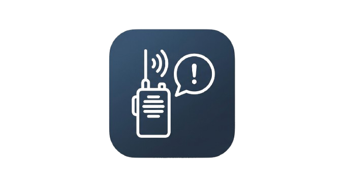

# <div align="center">Local Police Scanner</div>

<div align="center"><i>A Discord bot that monitors local police scanners.</i></div>

***

## Table of Contents

- [Local Police Scanner](#local-police-scanner)
	- [Table of Contents](#table-of-contents)
	- [Introduction](#introduction)
	- [Requirements](#requirements)
	- [Installation](#installation)
	- [Usage](#usage)
	- [Contributing](#contributing)
	- [License](#license)
	- [Credits](#credits)
	- [Contact](#contact)

## Introduction

A police scanner Discord bot automatically monitors live emergency radio frequencies, captures dispatch audio, and extracts real-time event details (like active incidents, location updates, and radio codes) to send instant alerts and summary updates directly to your Discord server.

## Requirements

- Python `3.14` or higher

## Installation

To install the required packages, run the following command:

```shell
pip install -r requirements.txt
```

Or, depending on your installation:

```shell
pip3 install -r requirements.txt
```

## Usage

To use the project, you can:

1. Install the requirements
2. Create a `.env` file or set the following environment variables for your local machine:

```bash
BROADCASTIFY_API = "API Key Here"
```

3. Run the `run.py` file

## Contributing

If you want to contribute to this project, please follow the guidelines below:

1. Fork the repository
2. Create a new branch for your changes
3. Make your changes and commit them
4. Push the new branch to your fork
5. Submit a pull request

## License

This project is licensed under the MIT license. See our [LICENSE](LICENSE) for more information.

## Credits

- [Valentina Banner](https://github.com/bannev1) - *Creator & Lead Developer*
- [Oliver](https://github.com/bananababoo) - *Engineer*

We are grateful for the support of our community and for the contributions of everyone who has helped make this project what it is.

## Contact

- **GitHub:** [@bannev1](https://github.com/bannev1)
